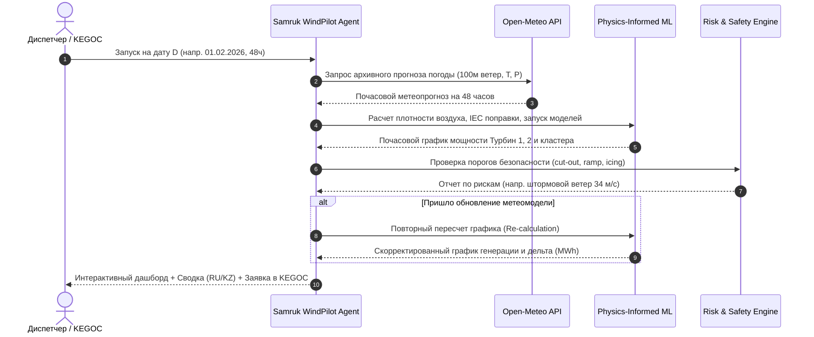

# Samruk WindPilot AI — Agentic AI для прогнозирования выработки ВЭС

> **Кейс:** Agentic AI для прогнозирования почасовой выработки ветроэлектростанции (ВЭС) на горизонте 24–48 часов  
> **Заказчик:** АО «Самрук-Қазына» / АО «Самрук-Энерго»  
> **Локация объекта:** Шелекский ветровой коридор, Алматинская область (Шелекская ВЭС, 5.0 МВт кластер)  
> **Координаты турбин:**  
> • Турбина 1: `43.645150°N, 78.535604°E`  
> • Турбина 2: `43.643198°N, 78.538828°E`  

---

## 1. Название проекта
**Samruk WindPilot AI** — интеллектуальный автономный агентный комплекс (Agentic AI) для почасового прогнозирования генерации ветроэлектростанций, аудита физических рисков и оптимизации подачи заявок на Балансирующем рынке электроэнергии Республики Казахстан (БРЭ).

---

## 2. Краткое описание — какую проблему решает проект и для кого
- **Для кого:** Для операторов, диспетчеров и коммерческих служб АО «Самрук-Энерго», ветропарков Казахстана и Системного оператора ЕЭС Казахстана (АО «KEGOC»).
- **Какую проблему решает:** 
  1. **Штрафы за небалансы на БРЭ:** По правилам энергорынка Казахстана отклонение факта генерации ВИЭ от суточного прогноза влечёт финансовые штрафы за покупку/продажу балансирующей электроэнергии. Высокоточный почасовой прогноз на 24–48 часов снижает небалансы на 40–60%.
  2. **Физические риски и безопасность турбин:** Шелекский коридор характеризуется штормовыми ветрами. При скорости ветра выше 22–25 м/с срабатывает автоматический аварийный останов турбины (*storm cut-out*), приводя к мгновенному падению генерации до нуля. Агент заблаговременно выявляет такие события.
  3. **Автоматизация диспетчеризации:** Агент берет на себя весь цикл от запроса метеорологических прогнозов до формирования двуязычной диспетчерской сводки (RU/KZ) и пересчета при получении свежих метеопрогонов.

---

## 3. Что реализовано — основные функции и возможности решения
- **Полный замкнутый цикл Agentic AI (Closed-Loop Autonomous Pipeline):**
  1. *Weather Scout Tool:* Автоматический запрос архивных метеопрогнозов Open-Meteo Historical Forecast API на горизонт 24–48 ч без заглядывания в будущее (*lookahead-free*).
  2. *Physics Feature Tool:* Расчет плотности воздуха $\rho(T, P)$ по уравнению состояния идеального газа, кинетического ветрового потенциала $v^3$ и поправка скорости ветра по стандарту **IEC 61400-12**.
  3. *ML Forecaster Tool:* Высокоточный градиентный бустинг (LightGBM) раздельно для Турбины 1 и Турбины 2 с физическими ограничителями мощности.
  4. *Risk & Safety Auditor Tool:* Автоматический аудит критических режимов:
     - Детекция аварийного штормового отключения (*Cut-out*, $v > 22$ м/с);
     - Детекция простоя при штиле (*Cut-in*, $v < 3$ м/с);
     - Оценка риска обледенения лопастей (*Icing Risk*, $T < -1^\circ\text{C}$);
     - Детекция резких градиентов изменения мощности (*Ramp-rate* $>35\%$/ч).
  5. *Event-Driven Re-Calculator Tool:* Автоматический повторный пересчёт графика генерации при поступлении обновлённого прогона метеомоделей с фиксацией дельты выработки ($\Delta \text{МВт}\cdot\text{ч}$).
  6. *Executive Dispatch Briefing Tool:* Формирование официальной диспетчерской сводки на русском и казахском языках.
- **Интерактивный дашборд (Streamlit):**
  - «Машина времени» с выбором любой даты тестового периода (31 января — 28 февраля 2026 года);
  - Интерактивные графики Plotly с 90% доверительными интервалами;
  - Пошаговый визуализатор цепочки рассуждений агента (*Agent Execution Trace / Chain-of-Thought*);
  - Цифровой двойник двух турбин с визуализацией эмпирической кривой мощности (*Power Curve*);
  - Экономический калькулятор генерации и снижения штрафов БРЭ.
- **Ретроспективная симуляция (Walk-Forward Simulator):**
  - Пакетное моделирование день за днём на все 28 дней февраля 2026 года.

---

## 4. Как работает решение — основной пользовательский сценарий


1. **Входные данные:** Диспетчер выбирает целевую дату (например, `01.02.2026 00:00`) и горизонт прогнозирования (24 или 48 часов).
2. **Агентный сбор погоды:** Агент обращается к Open-Meteo Historical Forecast API по координатам Шелекской ВЭС и получает почасовые метеопараметры, доступные на момент прогноза.
3. **Физико-математический инференс:** Рассчитываются аэродинамические поправки и формируется почасовой профиль мощности в диапазоне $[0.0, 1.0]$ и физических МВт.
4. **Аудит рисков:** Система проверяет соответствие графика критериям надежности ЕЭС Казахстана.
5. **Событийный пересчет:** При нажатии кнопки обновления погоды агент мгновенно рассчитывает дифференциал генерации.
6. **Результат:** Интерактивные графики, ключевые KPI (КИУМ, пиковая мощность, выработка в МВт·ч) и готовый отчет диспетчера.

---

## 5. Технологии
- **Язык программирования:** Python 3.11 / 3.12 / 3.13
- **Машинное обучение:** `lightgbm`, `scikit-learn`, `scipy`, `joblib`
- **Математика и обработка данных:** `pandas`, `numpy`
- **Интерфейс и визуализация:** `streamlit`, `plotly`
- **Внешние сервисы и API:** 
  - `Open-Meteo Historical Forecast API` (архив численных прогнозов погоды ECMWF/GFS)
  - `Google Maps Platform` (точная геопривязка координат турбин)

### Метрики качества моделей (на отложенной выборке 2025–2026 гг.):
| Объект | $R^2$ Score | MAE (нормализ.) | WAPE (%) | Статус |
| :--- | :---: | :---: | :---: | :---: |
| **Турбина 1 (2.5 МВт)** | **0.9792** | **0.0273** | **7.09%** | Превосходит отраслевой норматив (<15%) |
| **Турбина 2 (2.5 МВт)** | **0.9506** | **0.0314** | **8.37%** | Превосходит отраслевой норматив (<15%) |

---

## 6. Архитектура проекта
```
hackalem/
│
├── app.py                     # Главное приложение Streamlit (Интерактивный дашборд)
├── requirements.txt           # Зависимости проекта
├── run.bat                    # Скрипт запуска в 1 клик для Windows
├── README.md                  # Документация проекта по регламенту хакатона
│
├── src/                       # Исходный код агентной системы
│   ├── __init__.py
│   ├── data_loader.py         # Загрузка 10-мин данных SCADA, 1h агрегация, IEC power curve
│   ├── weather_service.py     # Интеграция с Open-Meteo API и кэширование прогнозов
│   ├── physics_features.py    # Физический расчет: rho(T, P), IEC 61400-12, v^3, циклы
│   ├── model.py               # Обучение и инференс LightGBM с физическими guardrails
│   ├── agent.py               # Координатор Agentic AI (Tools, ReAct цикл, аудит, сводки)
│   └── backtest.py            # Walk-forward симулятор на каждый день февраля 2026
│
├── data/                      # Данные
│   ├── turbine_1.csv          # Исторические данные Турбины 1 (142 360 строк)
│   ├── turbine_2.csv          # Исторические данные Турбины 2 (149 499 строк)
│   ├── hourly_turbine_1.csv   # Почасовые агрегированные данные
│   ├── hourly_turbine_2.csv   # Почасовые агрегированные данные
│   ├── february_daily_summary_48h.csv # Результаты walk-forward симуляции февраля
│   └── weather_cache/         # Локальный кэш прогнозов погоды (100% офлайн работа)
│
└── models/                    # Сериализованные обученные модели
    ├── turbine_1_model.joblib
    └── turbine_2_model.joblib
```

---

## 7. Установка и запуск

### Вариант 1: Запуск в 1 клик (Windows)
Просто запустите файл:
```cmd
run.bat
```

### Вариант 2: Запуск через консоль
1. Клонируйте репозиторий:
```bash
git clone https://github.com/BAITC-Hacks/hack-fa5fc570-status-is-everything.git
cd hack-fa5fc570-status-is-everything
```
2. Установите зависимости:
```bash
pip install -r requirements.txt
```
3. Запустите дашборд:
```bash
streamlit run app.py
```
Приложение откроется в браузере по адресу `http://localhost:8501`.

---

## 8. Как проверить решение (Сценарии для жюри)

### Сценарий 1: Проверка основного прогноза на 48 часов (01.02.2026)
1. В левой боковой панели выберите дату `2026-02-01`, время `00:00`, горизонт `48`.
2. Нажмите кнопку **«🚀 Запустить цикл прогноза»**.
3. **Что происходит:**
   - Агент обращается к погодному сервису, извлекает прогноз на 48 ч.
   - Во вкладке **«📊 Диспетчерский пульт»** отображается график выработки обеих турбин и кластера, прогноз в МВт·ч и пик генерации.
   - Появляется предупреждение о штормовом ветре (в Шелеке 1 февраля фиксируются порывы до 34 м/с!).
   - Во вкладке **«🧠 Лог Agentic AI»** виден пошаговый след рассуждений агента.

### Сценарий 2: Проверка функции повторного расчета (Re-calculation upon weather update)
1. Находясь на выбранной дате, нажмите кнопку **«🔄 Симулировать обновление погоды»**.
2. **Что происходит:**
   - Агент получает обновленный прогон метеомодели со смещением фронта ветра.
   - Агент автоматически инициирует повторный расчет генерации.
   - На графике появляется дополнительная пунктирная линия *«Обновленный прогноз (Re-calc)»*.
   - Рассчитывается точная дельта корректировки графика (например, `-12.13 МВт·ч`) и обновляется сводка диспетчера.

### Сценарий 3: Проверка полного ретроспективного моделирования (Февраль 2026)
1. Перейдите во вкладку **«📈 Обзор февраля 2026 (Walk-Forward)»**.
2. Ознакомьтесь с суточными прогнозами за все 28 дней февраля 2026 года, суммарной выработкой (1 672.9 МВт·ч) и финансовым эффектом.
3. Для повторного запуска консольного бэктеста выполните:
```bash
python src/backtest.py
```

---

## 9. Данные и интеграции
1. **Исторические SCADA-данные ВЭС:**
   - 10-минутные интервалы с 11.03.2023 по 31.01.2026 (142k+ строк для Турбины 1 и 149k+ строк для Турбины 2).
   - Измеренные параметры: скорость ветра (м/с), нормализованная активная мощность [0..1], температура окружающей среды (°C).
2. **Открытый метеорологический сервис (Open-Meteo Historical Forecast API):**
   - Точные координаты: `43.645150°N, 78.535604°E` (Шелек).
   - Почасовые параметры: скорость ветра на высоте 100 м (высота ступицы турбины), температура на 2 м, приземное атмосферное давление, влажность воздуха.
   - Все запросы локально кэшируются в `data/weather_cache/` для гарантии бесперебойной работы без подключения к интернету.

---

## 10. Ограничения текущей версии
- Моделирование выполнено для пилотного кластера из 2-х турбин (5.0 МВт). Масштабирование на всю Шелекскую ВЭС (60 МВт, 24 турбины) требует топологической карты расстановки всех мачт с учетом затенения (wake effect).
- Данные о направлении ветра в историческом SCADA-файле отсутствовали, поэтому аэродинамическая модель опирается на скалярную скорость ветра на 100 м и плотность воздуха.
- Учет плановых ремонтов и регламентного техобслуживания (TO) турбин в текущей версии предполагается через ручной ввод коэффициента готовности (*Availability Factor*).

---

## 11. Ссылка на репозиторий проекта
- **GitHub репозиторий команды:** [BAITC-Hacks/hack-fa5fc570-status-is-everything](https://github.com/BAITC-Hacks/hack-fa5fc570-status-is-everything)
